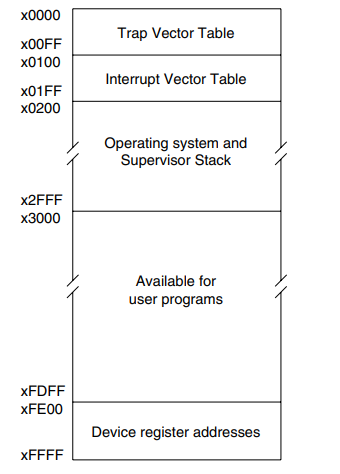
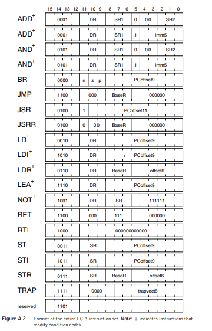

## lc3-emu
Little computer 3 emulator

## Architecture
### Memory
lc3 use 16-bit addressable memory with a 2^16 location address space. 

It means the computer has totally 2^17 bytes memory and each address space is 2 bytes.

### Register
- 8 16-bit registers (R0-R7) for general purpose
- 1 16-bit register (PC) for storing the address of next instruction
- 1 16-bit register (PSR) for containing status infomation about the currently executing process. 
    - PSR[15] -> privilege mode
        - PSR[15] = 0 -> supervisor mode
        - PSR[15] = 1 -> user mode
    - PSR[10:8] -> priority level (0 -> 7), 0 is the lowest
    - PSR[2:0] -> condition code
        - PSR[2] -> N (negative)
        - PSR[1] -> Z (zero)
        - PSR[0] -> P (positive)

### Stack
R6 is stack pointer and there are two stacks
- PSR[15] = 0 -> SP is SSP (supervisor stack)
- PSR[15] = 1 -> SP is USP (user stack)

### Input/Output
lc3's I/O is based in memory-mapped I/O. The I/O device registers specifically for input/output is mapped into memory and you can access these registers through accessing the mapped memory. 

- memory-mapped I/O device register
    - 0xFE00 -> KBSR (keyboard status register)
    - 0xFE02 -> KBDR (keyboard data register)
    - 0xFE04 -> DSR (display status register)
    - 0xFE06 -> DDR (display data register)
    - 0xFFFE -> MCR (machine control register)

There is one point that we should check io data when we read memory every time because we don't know whether the address is these mapped address.

And make sure you are in raw mode which means disable line buffering (send data when pressing enter key).

### Instruction Set
lc3 defines 15 16-bit instructions and 4-bit(high) opcode.

It is a load-store architecture, which means values in memory must be load into register before operating.

### Trap Service Routines

## Reference
[lcs-isa](./res/lc3-isa.pdf)